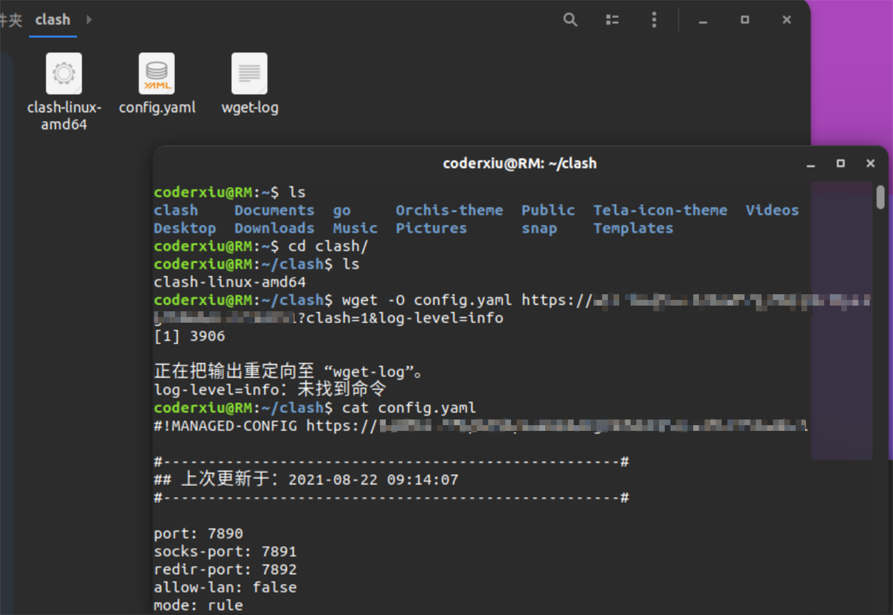

# Ubuntu Clash使用教程

1.下载clash

地址：https://github.com/Dreamacro/clash/releases

新建clash文件夹，并将文件解压至clash文件夹内

2.给其增加执行权限

`chmod +x clash-linux-amd64`

3.设置配置文件

`wget -O config.yaml 订阅链接?clash=1&log-level=info`

4.运行clash

`./clash-linux-amd64 -d .`

5.打开浏览器

 网址:[http://clash.razord.top/](https://www.oschina.net/action/GoToLink?url=http%3A%2F%2Fclash.razord.top%2F) 

6.根据需要选择规则

7.配置网络代理

